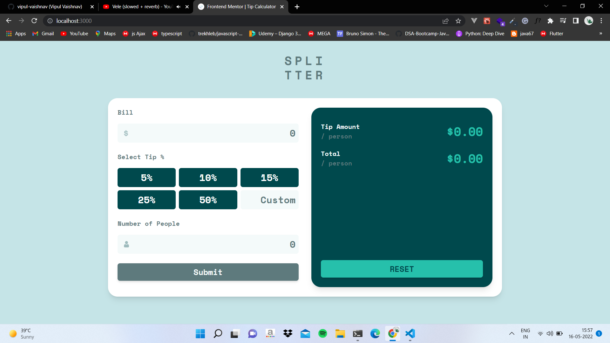

# Frontend Mentor - Tip calculator app solution

This is a solution to the [Tip calculator app challenge on Frontend Mentor](https://www.frontendmentor.io/challenges/tip-calculator-app-ugJNGbJUX). Frontend Mentor challenges help you improve your coding skills by building realistic projects.

## Table of contents

- [Overview](#overview)
  - [The challenge](#the-challenge)
  - [Screenshot](#screenshot)
  - [Links](#links)
- [My process](#my-process)
  - [Built with](#built-with)
  - [What I learned](#what-i-learned)
  - [Continued development](#continued-development)
  - [Useful resources](#useful-resources)
- [Author](#author)

## Overview

### The challenge

Users should be able to:

- View the optimal layout for the app depending on their device's screen size
- See hover states for all interactive elements on the page
- Calculate the correct tip and total cost of the bill per person

### Screenshot

Here is the screen shot of my work.

### Links

- Solution URL: [Code](https://github.com/vipul-vaishnav/React-Tip-Calculator)
- Live Site URL: [Live](https://react-tip-calc.netlify.app/)

## My process

### Built with

- Semantic HTML5 markup
- Flexbox
- CSS Grid
- Mobile-first workflow
- [Tailwind CSS](https://tailwindcss.com/) - Utility First CSS Framework
- [React](https://reactjs.org/) - JS library

### What I learned

I learnt about using tailwind classes and how to make a responsive UI with the help of breakpoints.
'sm' and 'md' breakpoints for small and medium screens respectively.

I also learnt about the implementation of **React** context API and form validation in react.

### Continued development

Still i feel struggling with making custom radio buttons, i will practice more working with forms in react and i also try to clean up the context file by using react's reducer hook and function.

### Useful resources

- [Tailwind Components](https://flowbite.com/docs/getting-started/introduction/) - This helped me for many cool tailwind components for quick development of this project.

## Author

- Website - [Vipul Vaishnav](https://github.com/vipul-vaishnav)
- Frontend Mentor - [@vipul-vaishnav](https://www.frontendmentor.io/profile/vipul-vaishnav)
- Twitter - [@\_\_stfuvipul](https://www.twitter.com/__stfuvipul)
